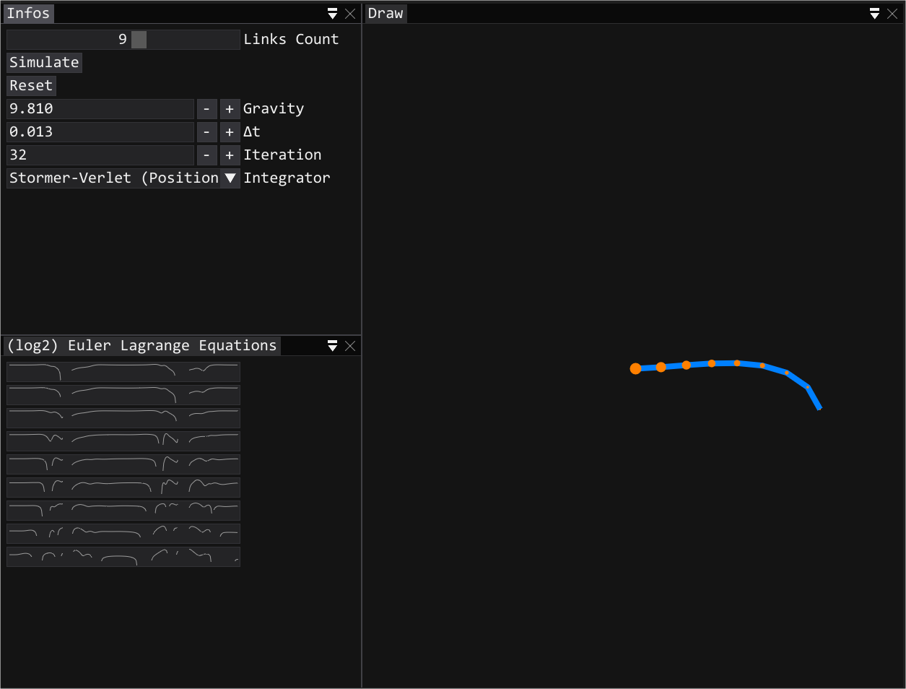

N-Pendulum to compare integrators (WIP).
Show Euler-Lagrange (numerical values) in log2 space as error measurement.

To build:

git clone --recursive git@github.com:soufianekhiat/N-Pendulum.git

cmake .

Open your project/solution

Enjoy.
